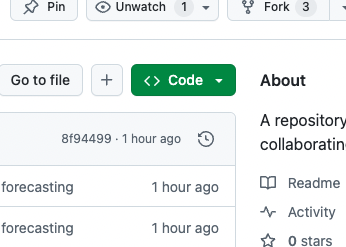
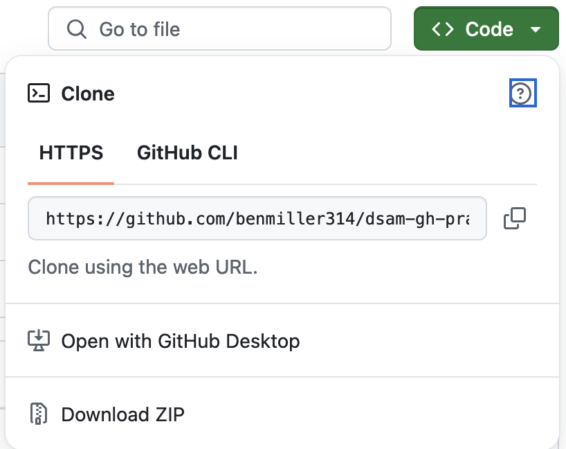

# Hands-on practice working with git, GitHub, and GitHub Desktop

## Where you're going
In this demo, you're going to...

1. Fork this repository
2. Clone it to your local computer
3. Create and edit a text file
4. Write your own commit messages
5. Push your changes back to the cloud
6. EXT: Edit two files at once, but commit them together
7. EXT: Work with a partner, exploring the pull request workflow

## Fork this repository!
To **fork** a repo is to _make a copy_ of it: all the files, and – importantly – the complete \*history\* of those files. This lets you safely play with and edit the files, without worrying that you'll overwrite someone else's work. For today, I've asked you to work in teams; for the major projects coming up, you'll have to decide whether to work in teams or individually.

Importantly, once you've forked a copy of a repo, you now have a version of it _that you control_. The web address of that repo, for example, will change to show your username, rather than the original owner's.

NB: For this exercise you can work alone or in pairs. If you're working in pairs, you'll want one partner to fork my repository, and the other to fork that fork. This will make it easier to combine your forks later on without worrying about overlapping with other groups in the original benmiller314 repo.

Go ahead and make your fork, using the button at the top right. 

## Clone the repo to your local computer

Because you control your own fork, you will now have the option to **clone** the repository: that is, to move it from the **clo**ud to **ne**arby, i.e. on your own local device.

There are several ways to do this, but they all start with clicking on the green button at the top of the repo that says "Code":

If you've installed GitHub Desktop, that's a user-friendly, graphic-user-interface option.  

NB: If you clone a forked repo using GH Desktop, it will ask you whether you want to contribute to the original project or your own fork. _Work on your own fork for now_; you can always share your work "upstream" later on.

## Create a text file

Did you know you can create files from right within your text editor? Just right-click in the file listing and choose New File. (Equivalently, you can use the File menu at the top of the screen.)

NB: Files created this way already exist on your computer, so you don't need to do anything new to "export" them to Finder or Windows Explorer – or GH Desktop. Remember: they're all just different ways of looking in the same place.

Pro tip: if you have a consistent way of naming your files, you can save yourself some headaches later. You might, then:
- Use all lowercase letters in the filename.
- Replace any spaces with underscores or hyphens.
- End the filename with **.md** – an extension that tells GitHub you're using ["markdown" syntax](https://guides.github.com/features/mastering-markdown/), such as the pound symbol (#) to mark headings and asterisks.
- End the file's contents with a blank line.  Blank lines are how Markdown signals a seam between paragraphs, so a blank line helps minimize weirdness if you merge with a colleague's version later on.

## Write in it

While you could write anything in your new file – and that's what we'll do if we're pressed for time – I thought it might be fun to call back to our conversation from week 1, about what we think of when we think of "digital."

Your task, then: write a short-short story about what makes *digital* different. Begin your story like this: "When everything was analog, ..."

How would you continue the sentence after the comma? Where will you make the turn to digitality? What changed?

Take a few minutes to find out!

## Save and commit

When you have something you're willing to live with – even if it's super-short, or even if you know it might need to change later on – save the file again and head back to GitHub Desktop.

With the changed file selected, **write a meaningful commit message**. In other words, don't just accept a default "update files": instead, say *how* you've updated it, e.g. "mention live performances".

Repeat until the time runs out.

EXT: Try decorating your story with an open-licensed image such as you might find on [search.creativecommons.org/](https://search.creativecommons.org/). Then practice writing a single commit for multiple files – something you couldn't have done on the GitHub website!

## Push (or PR) your changes

If you're editing locally and working alone, end each working session by pushing your changes to the cloud to back them up.

NB: If you're collaborating, you should instead file a _pull request_ to your repository to make sure the files haven't changed since you last fetched them. Read on if time allows.

### EXT: Collaboration and pull requests

When you're collaborating with other people, it becomes especially important that you don't overwrite files they might be using or editing themselves. To prevent shoving as a result of pushing, GitHub uses something called a **pull request**, or PR. A PR is essentially a more polite form of push: it shows the changes you've made, and invites others to **merge** them into the repository, but doesn't do so automatically. It's also safer: a PR builds in a peer review, and gives everyone a chance to reconcile any conflicts before making the changes official.

You can PR your own repo, if you want, but when you're working in a fork, you can also file a pull request back to the original repository. In that case, you can't push directly unless you also have admin privileges there – but the repo owner can review what you've sent, and then decide if they want to pull what you're offering. Thus the name! (You're *requesting* a pull.)

Either with a partner or back to the main assignment repository, try filing a pull request:

1. Either click "contribute" on the home screen of your forked repo, or go to the "Pull Requests" tab of either repo and click on the "New pull request" button: 
2. Verify that the arrow is pointing from your repo (the "head") back to the one you want to contribute to (the "base")... 
3. Write a short description of what you're sending over -- and notice that a single pull request can contain multiple commits, if you want.

That's it for sharing "upstream"!

To see what it would look like to pull request within your own project, click here.

<h3>GH Pull requests as / instead of commits</h3>
The merge and review process just takes you through a series of prompts and buttons; in the middle, you can write back and forth just as you can on the issue queue. Here's how it would look:

<figure>
<figcaption><ol><li>Top left. Instead of committing directly, you have the option to create a new branch and start a pull request.</li><li>Top right. Confirm the branches and direction of the proposed pull, and write a note to your partners about what you're proposing.</li><li>Middle left. GitHub will attempt to find conflicts.</li><li>Middle right. If there are none, your job is simple! Just decide whether to merge. (If there are, I recommend Atom as a tool to resolve them.)</li><li>Bottom left. The merge becomes a new commit in the destination repository, so you get to write a new commit message. Make it meaningful!</li><li>After the merge, you will be prompted to delete the source branch, since its contents are now integrated.</li></ul>
</figure>

